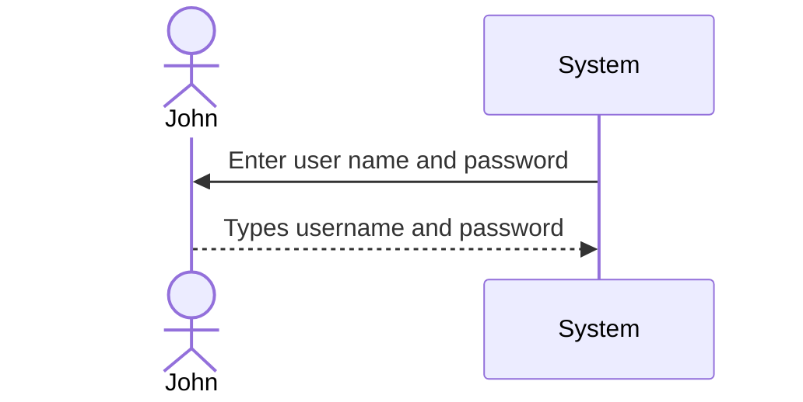

# Executive Summary
> A summary of all the essential information in the proposal so that a busy executive can read it quickly and decide what parts of the plan to read in more depth.

# System Request

**Project Sponsor:** Carmella Herrera, General Manager, Client Services Business Unit

**Business Need:** This project has been initiated . . .

**Business Requirements:** Using this system from our . . .

**Business Value:** The Client Services business unit . . .

**Special Issues or Constraints:** The capabilities described . . .

# Work plan
> The original work plan revised after having completed the analysis phase.

# Feasibility Analysis
> A revised feasibility analysis, using the information from the analysis phase.

# Requirements Definition
> A list of the functional and nonfunctional business requirements for the system.

### Functional Requirements (Clients):

1. **Learn about DrōnTeq Services**
   1. The system allows clients to review drone services by predefined categories.
   2. The system allows clients to search the range of drone flight services and data analyses by keywords.
   3. The system allows clients to view samples of drone flight service results and data analyses.

2. **Create DrōnTeq Account**
   1. The system enables clients to create a client account storing client data and (optional) payment information.
   2. The system enables clients to specify and store one or more geographic flight service areas.
   3. The system enables clients to add drone flight service and data analysis options to a “desired services” list.

### Functional Requirements (Pilots):

5. **Learn about DrōnTeq Pilot Partnership**
   1. The system allows pilots to review partnership information.
   2. The system allows pilots to review drone models available for special leasing rates within pilot partnership.
  
### Functional Requirements (Management):

9. **Drone Sales Management**
   1. The system will enable drone sales order creation.
   2.  The system will determine if the requested drone model is in stock.

### Nonfunctional Requirements:

1. **Operational**
   1. The system will run on any Web browser.
   2. Native apps will be developed for iOS and Android mobile and tablet devices.

2. **Performance**
   1. Download speeds of drone flight results and data analyses will be monitored and kept at an acceptable level.

3. **Security**
   1. Customer information will be secured.
   2. Payment information will be encrypted and secured.

4. **Cultural and political**
   - No special cultural and political requirements are expected.

# Use Cases
> A set of use cases that illustrate the basic processes that the system needs to support.

### Use Case Name : 

> __ID__ :

> __Priority__ :

> __Actor__ :

> __Description__ :

> __Trigger__ :

> __Type__ :

> __Preconditions__ :
>   1. Condition 1
>   2. Condition 2
>   3. ......

| Normal Course: | Information for Steps |
|---|---|
|1.0 Finalize Parts Request||
|1. Parts room clerk opens the parts . . . | <--- Parts Request record  |
|2. Parts room clerk verifies . . . |<--- Shop Work Order Record|

> __Postconditions__ :
>   1. Condition 1
>   2. Condition 2
>   3. ......

|Summary Inputs|Source|Summary Outputs| Destination|
|---|---|---|---|
|Final parts verification|Parts room clerk|Parts request record|Parts room clerk|
|Date/time completion|Parts room clerk|Shop work order record|Shop work order datastore|
|||Work Order ready notice|Technician|
 

# Process Model
> A set of process models and descriptions for the to‐be system. This may include process models of the current as‐is system that will be replaced.

# Data Model
> A set of data models and descriptions for the to‐be system. This may include data models of the as‐is system that will be replaced.

# Appendices
> These contain additional material relevant to the proposal, often used to support the recommended system. This might include results of a questionnaire survey or interviews, industry reports and statistics, etc.