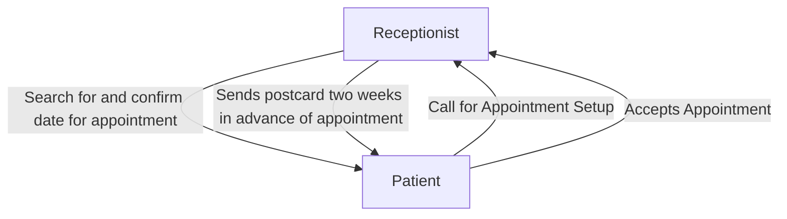

# Use Cases
> A set of use cases that illustrate the basic processes that the system needs to support.


### Use Case Name : 

> __ID__ : Appointment Made

> __Priority__ : High

> __Actor__ : Patient

> __Description__ : Patient Makes an appointment at the dentist office

> __Trigger__ : toothache, general checkup, etc.

> __Type__ : External

> __Preconditions__ :
>   1. A patient recognizes they need treatment

| Normal Course: | Information for Steps |
|---|---|
|1.0 Create Appointment||
|1. Patient calls in to schedule an appointment | <--- System Request for Schedule |
|2. Receptionist answers, finding room in the schedule for said patient's appointment |<--- Patient Information File Request record |
|3. Patient is in schedule | <-- System confirms scheduling|
|4. Receptionist sends postcard 2 weeks in advance to appointment| <-- System request for postcard|

> __Postconditions__ :
>   1. Patient's appoitment is set up
>   2. Patient receives postcard two weeks in advance of appointment
>   3. Patient either calls and cancels or goes to appointment

|Summary Inputs|Source|Summary Outputs| Destination|
|---|---|---|---|
|Patient Appointment Request|Patient|Schedule Confirmation|Dental Office|
|Request for Postcard|Receptionist|Postcard|Patient Home|
 


# Process Model
> A sample Data Flow Diagram





### Use Case Name : 

> __ID__ : Patient Arrival to Appoitment

> __Priority__ : High

> __Actor__ : Patient

> __Description__ : Patient arrives at office, checks into their appointment, and completes the needed tasks

> __Trigger__ : Patient arrival

> __Type__ : External

> __Preconditions__ :
>   1. Patient travels to office
>   2. Staff is prepared for Patient's arrival
> 
| Normal Course: | Information for Steps |
|---|---|
|1.0 Arrive at Appointment||
|1. Patient arrives at dental office for appointment |  |
|2. Receptionist greets patient and confirms there appointment |<--- System request for appointment |
|3. Patient is in schedule | <-- System confirms scheduling|
|4. Receptionist provides patient with information they need to complete/update| <-- Patient Information File Request|
|5. Patient Receives Patient Information File | |
|6. Patient fills out missing information and returns the file to the receptionist | |

> __Postconditions__ :
>   1. Patient is checked in
>   2. Patient has all information correctly completed for staff
>   3. Patient is prepared for their appointment to start

```mermaid
flowchart

    E1["`Receptionist`"]


    E2["`Patient`"]
    P0["`Patient Information File`"]


    E2 -- Arrives for appointment --> E1
    E1 -- Search for and confirm appointment --> E2
    E2 -- Receives greeting and confirmation --> E1
    E1 -- Gives Patient Information File --> E2
    E2 -- Fills out Patient Information File -- > P0
    E2 -- Returns Patient Information File --> E1

```